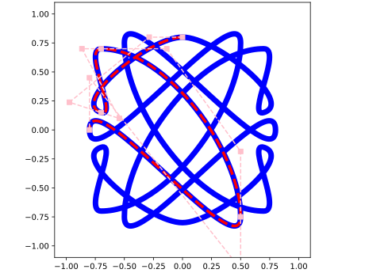
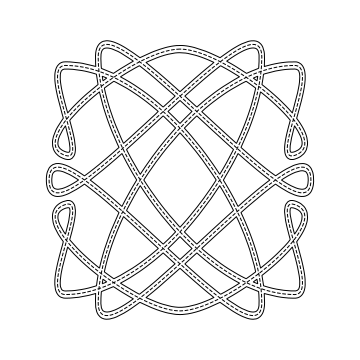
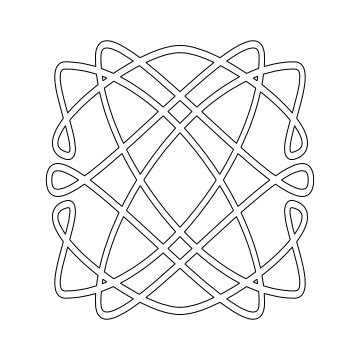

# Knots

Based on _Celtic Art: The Methods of Construction_ [^book], which covers how to
create Celtic-style knot work this code automates the initial steps for basic
knots.

## Method

Very briefly, the method is to:

1. construct a single line that is the path of the knot
2. expand to a ribbon around the center line
3. remove the center line
4. interleave the crossings
5. elaboration and decoration

Using this code you will be able to generate up to stage 3 that can be printed
and traced.

To make this concrete, the initial step is to generate the path of the knot,
shown here including the control points used for path and indicating the unit
cell that was mirrored to make the complete knot.



Dropping the construction marks and showing the center line gives



and removing the center line gives



At this stage, this is ready to be printed to begin the manual process of
interleaving the crossings.  Pick any crossing and decide which direction will
be "over".  You then move either direction along the ribbon alternating
over/under until you return to the starting point.


## Quick start

```bash
pixi run scratch
```

and then edit `scripts/scratch.py` to your liking.

## Contributions


This project is typed and has ruff formatting and linting applied.

There are no tests other than looking at the demo section of the docs.

The docs can be rebuilt via:

```bash
pixi run build_docs
```

Contributions are welcome, particularly additional knots in `demos.py`.


[^book]: Bain, George. Celtic Art: The Methods of Construction. Contsable, 1996. ISBN 978-0-09-476900-7
